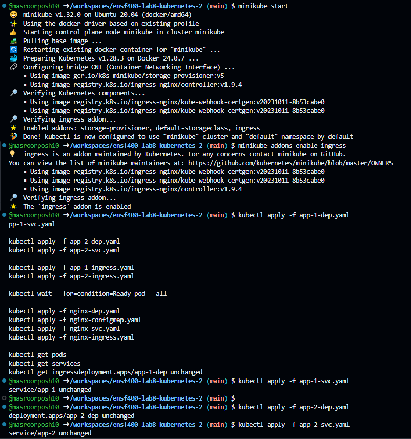
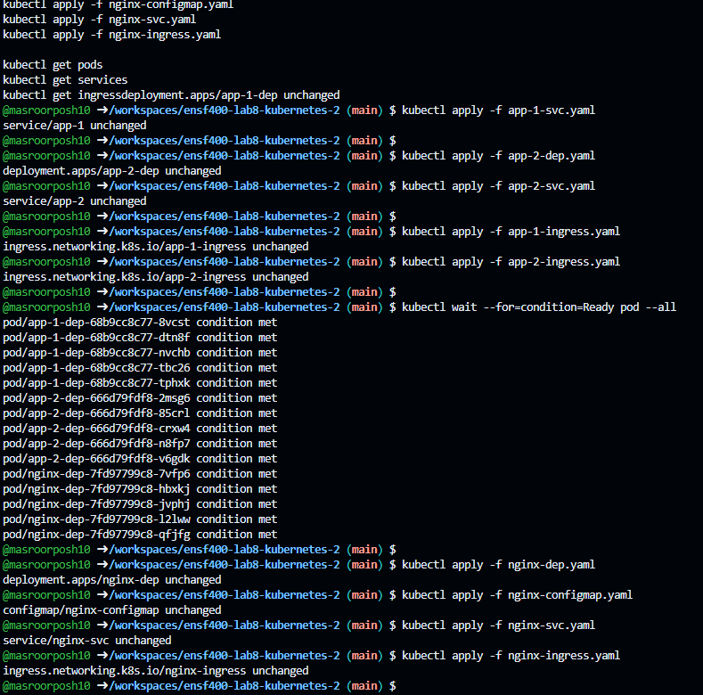
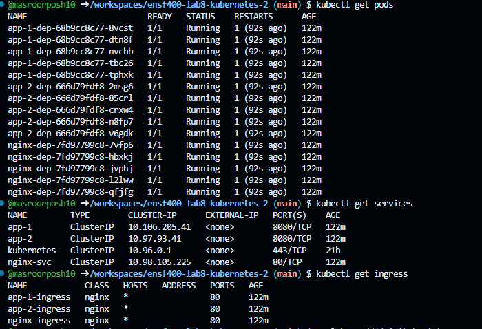
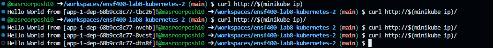

# ENSF 400 Lab 8
 - Masroor Pos
 - UCID: 30156171

## Prerequisites

- Minikube
- kubectl
- ingress

## Running the Project

### Start Minikube:

`minikube start`
### Enable Ingress addon:

`minikube addons enable ingress`
### Apply Kubernetes:

`kubectl apply -f app-1-dep.yaml`

`kubectl apply -f app-1-svc.yaml`

`kubectl apply -f app-2-dep.yaml`

`kubectl apply -f app-2-svc.yaml`

`kubectl apply -f app-1-ingress.yaml`

`kubectl apply -f app-2-ingress.yaml`

`kubectl wait --for=condition=Ready pod --all`

`kubectl apply -f nginx-dep.yaml`

`kubectl apply -f nginx-configmap.yaml`

`kubectl apply -f nginx-svc.yaml`

`kubectl apply -f nginx-ingress.yaml`

### Verify:
`kubectl get pods`
`kubectl get services`
`kubectl get ingress`

### Access the application:

`curl http://$(minikube ip)`

### To stop:
`kubectl delete -f .`

## output:

