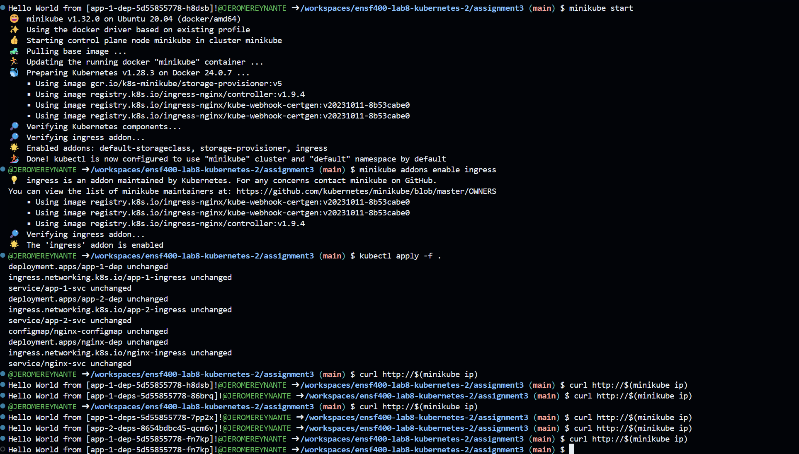

# Procedure for Assignment 3
1. Requires Minikube for Codespaces. Install First
2. After Setting up Minikube, run command Minikube Start
3. Install ingress addon with the command "minikuber addons enable ingress"
4. Apply all of the yaml files using this command **kubectl apply -f .** in the assignment3 directory
5. Once applied run **curl http://$(minikube ip)**

**Output Shown in Image below**

